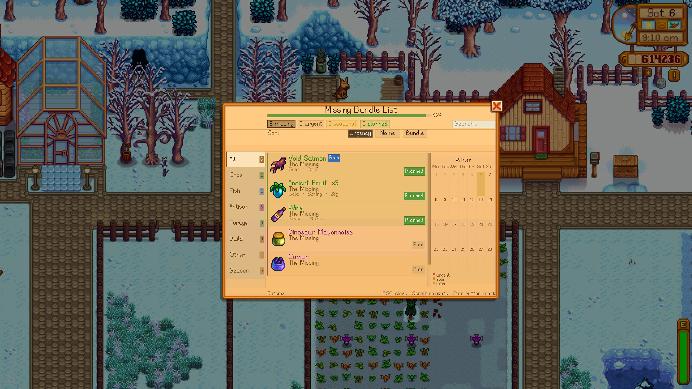
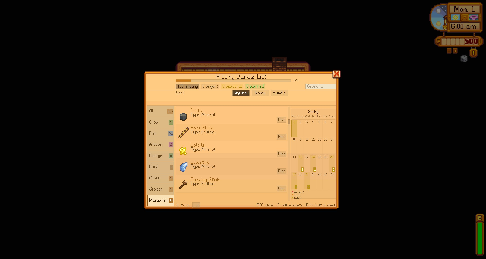

<div align="center">


# Season Planner & Bundle Reminder

### Plan smarter. Deliver faster. Miss nothing.

Tracks every missing Community Center bundle item, marks last planting days on the in-game calendar, and adds smart tooltips to inventory, chest, shop, and Community Center screens.

[](https://smapi.io)
[](https://www.stardewvalley.net/)
[](manifest.json)
[](LICENSE)
[](#languages)

</div>

---

> Bu dosya Nexus Mods sayfa aciklamasi icin hazirlanmistir.
> Nexus editore yapistirmak icin asagidaki BBCode bolumunu kullan.

---

## Why This Mod

If you have ever said "I forgot that crop", "I missed the rain fish", or "I had the item but forgot the bundle", this mod is built for you.

Season Planner turns Community Center progress into a clear action list:
- What is still missing
- How urgent it is
- Where and when you can get it
- What you should do today

---

## At a Glance

- Open the panel anytime with F5
- See all missing bundle items grouped and sorted by urgency
- Mark items as planned and track completion
- View last planting deadlines on a dedicated calendar tab
- Get context-aware tooltips in inventory, chests, shops, and bundle screens
- Receive HUD alerts for deadlines, rain-fish opportunities, and planned-item completion
- Keep a session notification log inside the panel

---

## Feature Highlights

### Bundle Panel (F5)

Open from anywhere. Items are grouped by category (Crop, Fish, Artisan, Forage, Construction, Other), then sorted by urgency so your next action is always obvious.

<div align="center">

</div>

<div align="center">

</div>

### Detailed Calendar View

Switch to the Calendar tab for a 7-column week layout. Deadline days show item-count badges, and hover reveals exactly which bundle items are due.

<div align="center">

</div>

### Planning System

Mark any entry as planned and filter to planned-only mode. When a planned item is delivered, you get an instant HUD confirmation.

<div align="center">

</div>

<div align="center">

</div>

### Museum Tracking Tab

Track donation progress in one place. Already donated entries are clearly marked and pushed down the list.

<div align="center">

</div>

### Smart Tooltips Everywhere

Inventory and chest tooltips show:
- Bundle name
- Required quantity and quality
- Season and grow info
- Delivery status

<div align="center">

</div>

Community Center ingredient hover tooltips show fish location, season, time range, and weather directly on the bundle screen.

<div align="center">

</div>

Shop hover tooltips work in Pierre, Willy, Sandy, Krobus, and more.

| Pierre's Shop | Willy's Shop | Sandy's Shop |
|:---:|:---:|:---:|
|  |  |  |

| Krobus Shop |
|:---:|
|  |

### HUD Alerts and Notification Log

The mod checks each day and warns for:
- Upcoming planting deadlines
- Tomorrow rain chance when rain-only fish are still needed
- Planned items completed

You can review alert history in the panel's Log tab.

### GMCM Settings

All major systems are configurable in-game with Generic Mod Config Menu.

<div align="center">

</div>

---

## What Is New in 1.4.0

- Search bar with instant item and bundle filtering
- Detailed weekly calendar with badges and hover details
- Community Center ingredient hover tooltips
- Delivered-state line for completed bundle requirements
- In-panel notification log
- Better mod fish location support (SVE and similar content mods)
- Bilingual SMAPI logs (TR + EN)
- Bundle cache reliability fixes
- Full i18n coverage for all visible strings

---

## Installation

### Requirements

- Stardew Valley 1.6+
- [SMAPI 4.1+](https://smapi.io)
- [Generic Mod Config Menu](https://www.nexusmods.com/stardewvalley/mods/5098) (optional)

### Steps

1. Download the latest file from the Files tab
2. Extract into Stardew Valley/Mods/
3. Launch the game with SMAPI

---

## Controls

| Input | Action |
|---|---|
| F5 | Open or close the panel |
| ESC or right-click | Close the panel |
| Mouse wheel | Scroll item list |
| Tab click | Filter category |
| Search box | Filter by item or bundle |
| Plan button | Mark item as planned |
| Drag panel header | Move panel |

---

## Configuration

| Setting | Default | Description |
|---|:---:|---|
| Show Calendar Markers | On | Highlight last planting days |
| Show HUD Notifications | On | Morning deadline and rain-fish alerts |
| Show Inventory Tooltips | On | Bundle info on inventory hover |
| Show Chest Tooltips | On | Bundle info on chest hover |
| Show Shop Source | On | Show where to buy items |
| Filter Construction Items | On | Hide Wood/Stone style entries |
| Warning Threshold (Days) | 7 | Alert lead time before deadline |
| Panel Hotkey | F5 | Open or close panel |
| Panel Size (%) | 100 | Scale panel (50-150) |
| Bundle Tooltip Size (%) | 100 | Scale bundle tooltip (50-200) |
| Seed Tooltip Size (%) | 100 | Scale seed tooltip (50-200) |

---

## Compatibility

The mod reads Data/Bundles, Data/Crops, Data/Shops, Data/Fish, and Data/Locations through SMAPI's content API.

That means mods patching these assets are supported automatically.

### Explicitly Tested and Supported

These mods/content packs are verified to work:

| Mod | Support |
|---|---|
| Content Patcher | Full |
| Stardew Valley Expanded | Full |
| Cornucopia - More Crops | Full |
| Cornucopia - Cooking Recipes | Full |
| Bonster's Crops | Full |
| Culinary Delight | Full |
| Better Things | Full |
| Json Assets | Full |
| Dynamic Game Assets | Full |
| Generic Mod Config Menu | Full |

### Notes

- Most crop/fish/shop/location content mods are auto-detected if they patch standard game data assets.
- If a mod adds custom bundle-like systems outside vanilla data paths, those may require future targeted support.
- If you find a conflict, share your SMAPI log and mod list in the bug report page.

---

## Performance and Safety

- No destructive data edits
- Uses SMAPI content APIs for compatibility-first reads
- Designed for normal gameplay sessions with lightweight checks and cached lookups

---

## FAQ

### Does this work with Joja route?

Core reminder systems still work, but the mod is primarily designed around Community Center bundle tracking.

### Is GMCM required?

No. The mod runs without GMCM. GMCM only adds an in-game settings UI.

### Can I use this with content packs and modded fish/crops?

Yes. The scanner is built to read patched game data, including common expansion mods.

---

## Languages

| Language | File | Status |
|---|---|:---:|
| English | i18n/default.json | done |
| Turkce | i18n/tr.json | done |
| Your language? | i18n/xx.json | open |

---

## Source and Support

- [GitHub Repository](https://github.com/devjawen/stardew-season-planner)
- [Report a Bug](https://github.com/devjawen/stardew-season-planner/issues) (please include SMAPI log and mod list)
- [Discussions](https://github.com/devjawen/stardew-season-planner/discussions)

---

## Permissions and Attribution

This project uses CC BY-NC-ND 4.0.

You are welcome to use and share this mod with credit.
- Attribution is required
- Commercial use is not allowed
- Modified redistributions are not allowed

License: https://creativecommons.org/licenses/by-nc-nd/4.0/

(c) 2024 Jawen

---

## Images Upload Order (Nexus)

1. images/1.4.0/Banner.png
2. images/1.4.0/Banner2.png
3. images/1.4.0/bundlelistpanel.png
4. images/1.4.0/bundlelistpaneldetails.jpg
5. images/1.4.0/bundlelistpanelcalendar.png
6. images/1.4.0/bundlelistpanelplanned.jpg
7. images/1.4.0/missingbundlelistplanned.jpg
8. images/1.4.0/bundlelistpanelmuseum.jpg
9. images/1.4.0/inventorytooltip.jpg
10. images/1.4.0/communitycenter.jpg
11. images/1.4.0/pierreshop1.jpg
12. images/1.4.0/willys shop.jpg
13. images/1.4.0/sandys shop.jpg
14. images/1.4.0/krabus.jpg
15. images/1.4.0/genericmodmenusettings.jpg

---

## Suggested Nexus Tags

Gameplay Mechanics, User Interface, Quality of Life, Utilities, HUD and UI

---

## BBCode (Nexus Editor)

<details>
<summary>Click to expand BBCode</summary>

```bbcode
[center][img]https://raw.githubusercontent.com/devjawen/stardew-season-planner/dev/images/1.4.0/Banner.png[/img][/center]

[center][size=5][b]Season Planner & Bundle Reminder[/b][/size]
[i]Plan smarter. Deliver faster. Miss nothing.[/i][/center]

[center]
[url=https://smapi.io][img]https://img.shields.io/badge/SMAPI-4.1%2B-2b8a3e?style=flat-square[/img][/url]
[url=https://www.stardewvalley.net/][img]https://img.shields.io/badge/Stardew%20Valley-1.6%2B-c0692e?style=flat-square[/img][/url]
[img]https://img.shields.io/badge/Version-1.4.0-1f6feb?style=flat-square[/img]
[img]https://img.shields.io/badge/Languages-EN%20%7C%20TR-informational?style=flat-square[/img]
[/center]

[line]

[size=4][b]Why This Mod[/b][/size]

If you keep missing bundle timing windows, this mod gives you a clear daily plan:
[list]
[*] What is missing
[*] What is urgent
[*] Where and when to get it
[*] What to do next
[/list]

Press [b]F5[/b] any time to open the panel.

[line]

[size=4][b]Feature Highlights[/b][/size]

[b]Bundle Panel (F5)[/b]
Open anywhere. Grouped by category and sorted by urgency with instant search.
[img]https://raw.githubusercontent.com/devjawen/stardew-season-planner/dev/images/1.4.0/bundlelistpanel.png[/img]
[img]https://raw.githubusercontent.com/devjawen/stardew-season-planner/dev/images/1.4.0/bundlelistpaneldetails.jpg[/img]

[b]Detailed Calendar[/b]
7-column weekly layout with deadline badges and hover details.
[img]https://raw.githubusercontent.com/devjawen/stardew-season-planner/dev/images/1.4.0/bundlelistpanelcalendar.png[/img]

[b]Planning System[/b]
Mark planned items and get notified when they are completed.
[img]https://raw.githubusercontent.com/devjawen/stardew-season-planner/dev/images/1.4.0/bundlelistpanelplanned.jpg[/img]
[img]https://raw.githubusercontent.com/devjawen/stardew-season-planner/dev/images/1.4.0/missingbundlelistplanned.jpg[/img]

[b]Museum Tab[/b]
Track donation progress in one dedicated tab.
[img]https://raw.githubusercontent.com/devjawen/stardew-season-planner/dev/images/1.4.0/bundlelistpanelmuseum.jpg[/img]

[b]Smart Tooltips[/b]
Inventory, chest, shop, and Community Center ingredient hover tooltips with useful context.
[img]https://raw.githubusercontent.com/devjawen/stardew-season-planner/dev/images/1.4.0/inventorytooltip.jpg[/img]
[img]https://raw.githubusercontent.com/devjawen/stardew-season-planner/dev/images/1.4.0/communitycenter.jpg[/img]
[img]https://raw.githubusercontent.com/devjawen/stardew-season-planner/dev/images/1.4.0/pierreshop1.jpg[/img]
[img]https://raw.githubusercontent.com/devjawen/stardew-season-planner/dev/images/1.4.0/willys%20shop.jpg[/img]
[img]https://raw.githubusercontent.com/devjawen/stardew-season-planner/dev/images/1.4.0/sandys%20shop.jpg[/img]
[img]https://raw.githubusercontent.com/devjawen/stardew-season-planner/dev/images/1.4.0/krabus.jpg[/img]

[b]HUD Alerts + Log[/b]
Daily warnings for planting deadlines, rain fish opportunities, and planned item completion. Review alert history inside the panel.

[b]GMCM Support[/b]
All core options configurable in-game.
[img]https://raw.githubusercontent.com/devjawen/stardew-season-planner/dev/images/1.4.0/genericmodmenusettings.jpg[/img]

[line]

[size=4][b]What's New in 1.4.0[/b][/size]

[list]
[*] Real-time search bar
[*] Detailed calendar with hover details
[*] Community Center ingredient tooltips
[*] Delivered-state lines for completed requirements
[*] Notification log tab
[*] Better mod fish support
[*] Bilingual SMAPI logs (TR + EN)
[*] Bundle cache reliability fixes
[*] Full i18n coverage
[/list]

[line]

[size=4][b]Installation[/b][/size]

[list]
[*] Stardew Valley 1.6+
[*] [url=https://smapi.io]SMAPI 4.1+[/url]
[*] [url=https://www.nexusmods.com/stardewvalley/mods/5098]Generic Mod Config Menu[/url] (optional)
[/list]

[list=1]
[*] Download latest file
[*] Extract to Stardew Valley/Mods/
[*] Launch via SMAPI
[/list]

[line]

[size=4][b]Controls[/b][/size]

[table]
[tr][th]Input[/th][th]Action[/th][/tr]
[tr][td]F5[/td][td]Open or close panel[/td][/tr]
[tr][td]ESC / right-click[/td][td]Close panel[/td][/tr]
[tr][td]Mouse wheel[/td][td]Scroll list[/td][/tr]
[tr][td]Tab click[/td][td]Filter category[/td][/tr]
[tr][td]Search box[/td][td]Filter item or bundle[/td][/tr]
[tr][td]Plan button[/td][td]Mark planned[/td][/tr]
[tr][td]Drag header[/td][td]Move panel[/td][/tr]
[/table]

[line]

[size=4][b]Compatibility[/b][/size]

Supports asset patches through SMAPI content APIs (Data/Bundles, Data/Crops, Data/Shops, Data/Fish, Data/Locations).

[b]Explicitly tested and supported:[/b]
[list]
[*] Content Patcher
[*] Stardew Valley Expanded
[*] Cornucopia - More Crops
[*] Cornucopia - Cooking Recipes
[*] Bonster's Crops
[*] Culinary Delight
[*] Better Things
[*] Json Assets
[*] Dynamic Game Assets
[*] Generic Mod Config Menu
[/list]

[b]Compatibility notes:[/b]
[list]
[*] Most crop/fish/shop/location content mods are auto-detected when they patch standard game data assets.
[*] Mods with fully custom bundle systems outside vanilla data paths may need future targeted support.
[*] If you hit a conflict, please report with SMAPI log and full mod list.
[/list]

[line]

[size=4][b]Source and Support[/b][/size]

[list]
[*] [url=https://github.com/devjawen/stardew-season-planner]GitHub Repository[/url]
[*] [url=https://github.com/devjawen/stardew-season-planner/issues]Report a Bug[/url] (include SMAPI log and mod list)
[*] [url=https://github.com/devjawen/stardew-season-planner/discussions]Discussions[/url]
[/list]

[line]

[size=4][b]Permissions and Attribution[/b][/size]

[url=https://creativecommons.org/licenses/by-nc-nd/4.0/]CC BY-NC-ND 4.0[/url]

[list]
[*] Attribution required
[*] No commercial use
[*] No modified redistributions
[/list]

(c) 2024 Jawen

[center][size=1]Made with coffee by [url=https://github.com/devjawen]Jawen[/url][/size][/center]
```

</details>

---

<div align="center">
  <sub>Made with coffee by <a href="https://github.com/devjawen"><b>Jawen</b></a></sub>
</div>
